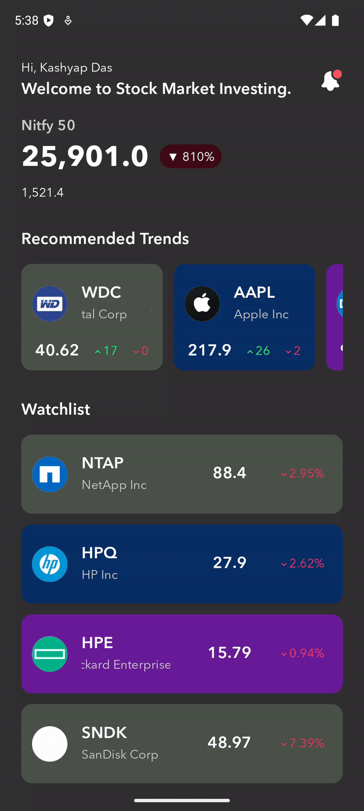

# Stock Market App
### Compose and Kotlin Mutli Platform with MVI & MVVM with clean architecture

* **Data** (DTOs, Mappers, repository) + **Domain** (State, Action, Viewmodel, UI Data) + **Presentation** (Navigation, UI Composables & their Components)

* Libraries Navigation for Compose, Coil Image, Ktor with serialization,  DI with Koin, Room with SQLite

* Using https://finnhub.io/docs/api/

## Home Screen Preview

 
